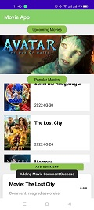
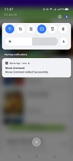
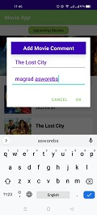
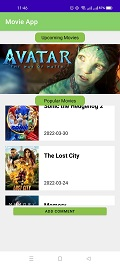
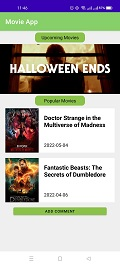

პროექტის სახელია Movie App, და მიზნად ისახავს ადამიანებს მიაწოდოს ინფორმაცია მიმდინარე და მოსალოდნელი ფილმების შესახებ.

პროექტი დაწყებისთანავე განთავსდა Git რეპოზიტორიზე - https://github.com/TateKeldishvili777/FinalProjectKotlin.git

Movie App - ის ძირითადი ფუნქციონალი მოიცავს, მიმდინარე პოპულარული ფილმების სიას და მათი გამოსვლის თარიღებს,
ასევე მომხმარებელს საშუალება აქ ნახოს ის ფილმები, რომელთა პრემიერაც დაგეგმილია უახლოეს მომავალში.
აპლიკაციაში ასევე შესაძლებელია სურვილისამებრ დაემატოს კომენტარი ფილმზე, რათა სხვებს შეექმნათ წარმოდგენა ამა თუ იმ ფილმზე.

პროექტში შესრულებულია Kotlin- ზე და მოიცავს შემდეგ კომპონენტებს:

* Retrofit
* Broadcast Receiver
* View Pager
* Push Notification
* Recyclerview
* Small Validation
* Menu
* Fragments
* AlertDialog

მოცემულია აპლიკაციის რამდენიმე სქრინი 

 |
 |
 

 |
 

საკონტაქტო ინფორმაცია: 

ტელეფონი: 571 40 42 08 , 592 01 71 86

მეილი: tateqeldishvili777@gmail.com , armen.garibyan.1@btu.edu.ge

პროექტის შექმნაზე მუშაობდნენ ტატე ქელდიშვილი და არმენ ღარიბიანი.

